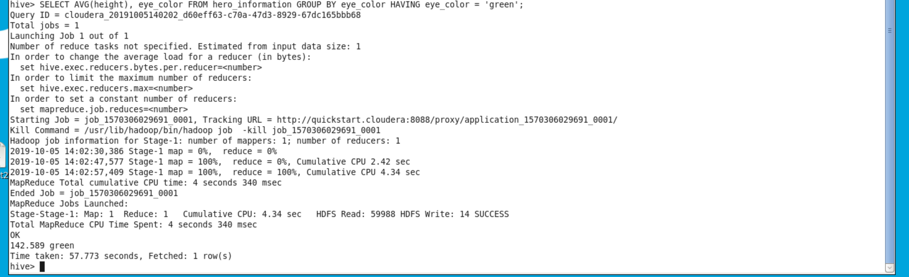
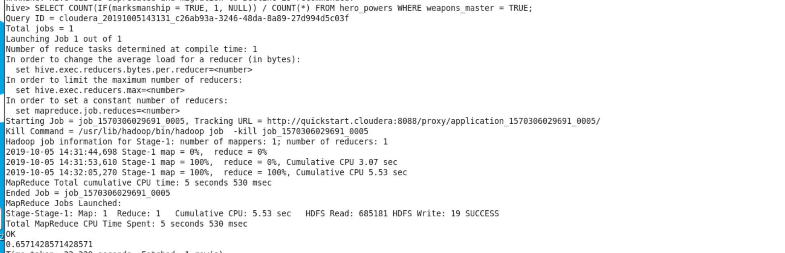
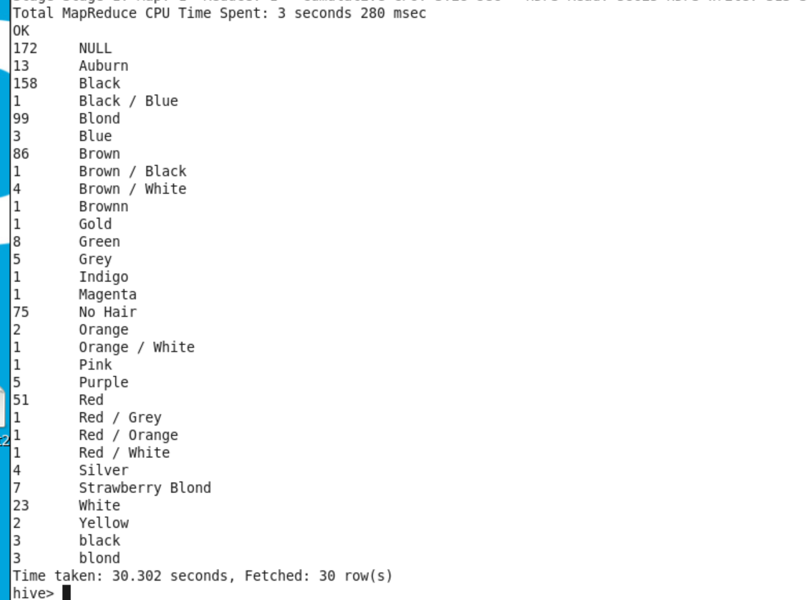
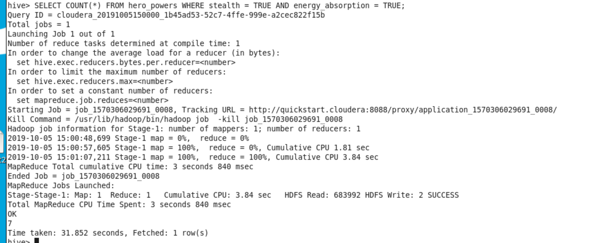
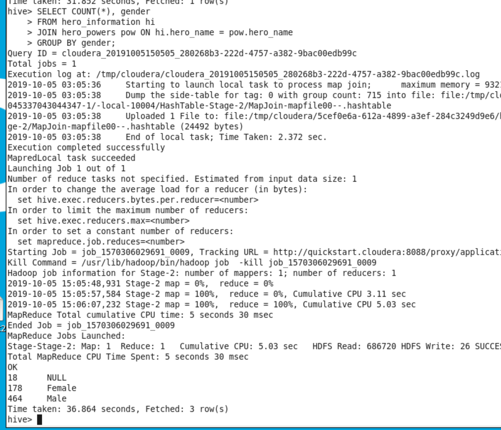
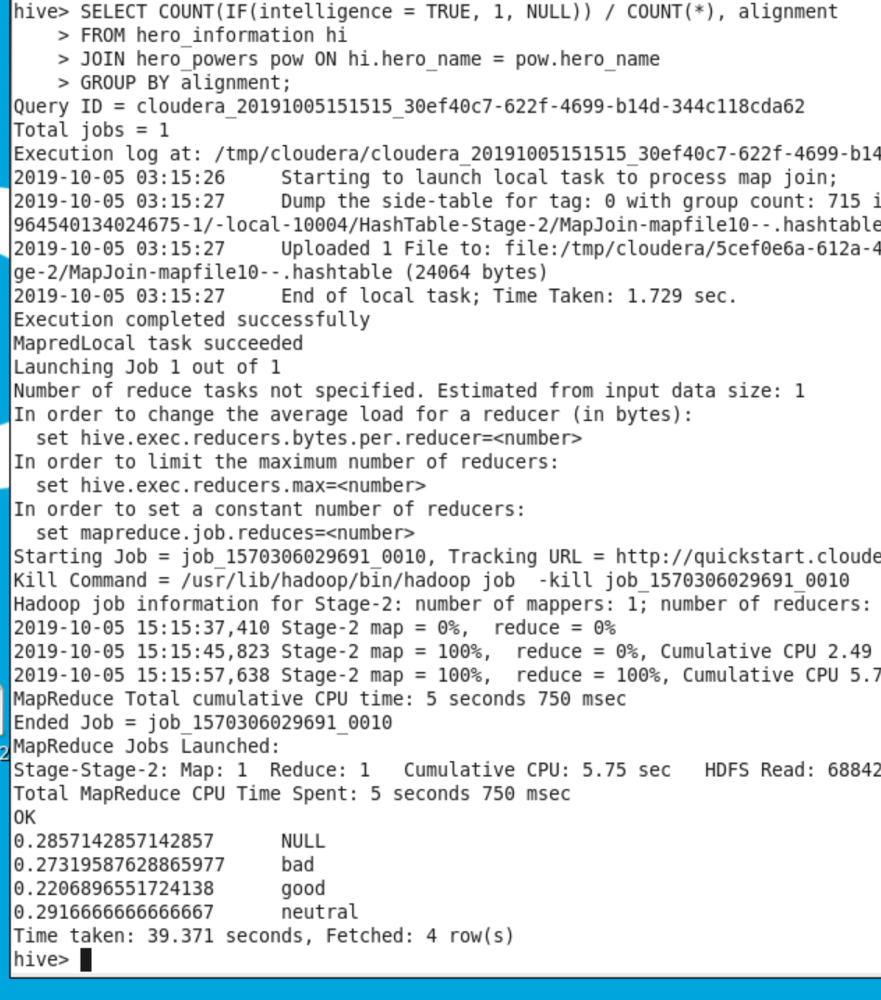
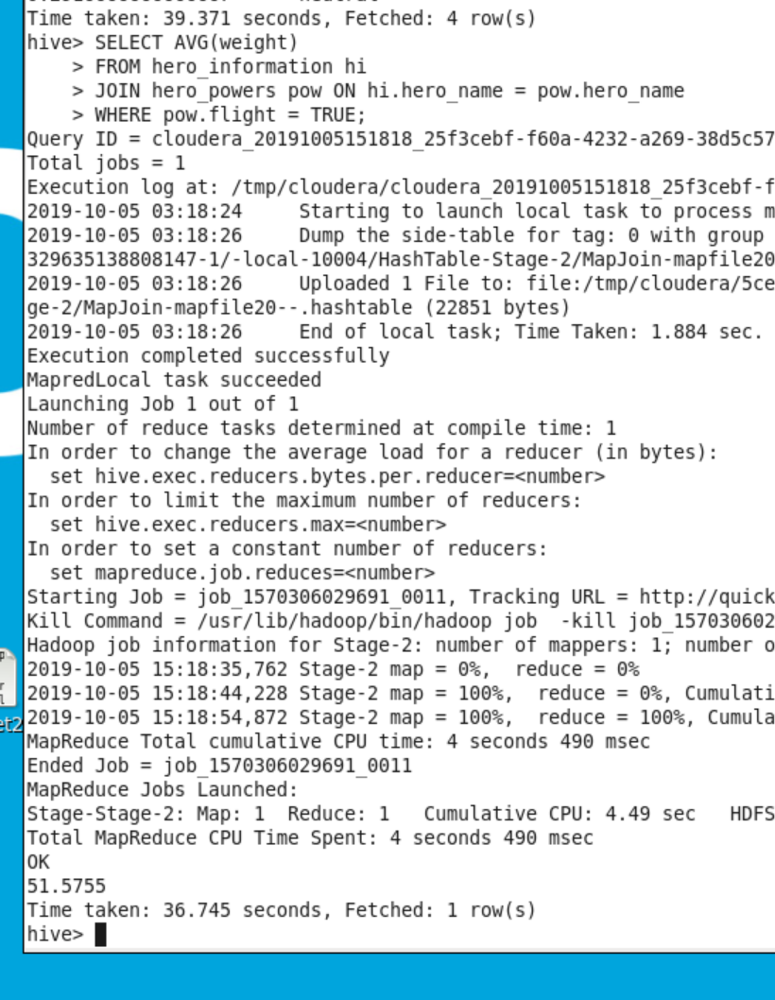
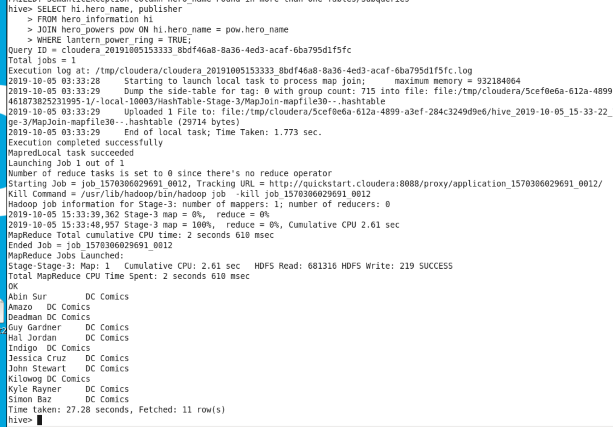

Dataset used: Super Heroes
Usecase: HIVE

## Table Creation

### Creating the Hero Information table
```sql
CREATE TABLE hero_information (
hero_id        INT,
hero_name      STRING,
gender         STRING,
eye_color      STRING,
race           STRING,
hair_color     STRING,
height         DECIMAL,
publisher      STRING,
skin_color     STRING,
alignment      STRING,
weight         DECIMAL
) row format delimited fields terminated by ',' stored as textfile
TBLPROPERTIES ('skip.header.line.count'='1','serialization.null.format' = '-');
```

### Creating Hero Powers table:
```sql
Create table hero_powers (
hero_name                 STRING,
agility                   BOOLEAN,
accelerated_healing       BOOLEAN,
lantern_power_ring        BOOLEAN,
dimensional_awareness     BOOLEAN,
cold_resistance           BOOLEAN,
durability                BOOLEAN,
stealth                   BOOLEAN,
energy_absorption         BOOLEAN,
flight                    BOOLEAN,
danger_sense              BOOLEAN,
underwater_breathing      BOOLEAN,
marksmanship              BOOLEAN,
weapons_master            BOOLEAN,
power_augmentation        BOOLEAN,
animal_attributes         BOOLEAN,
longevity                 BOOLEAN,
intelligence              BOOLEAN,
super_strength            BOOLEAN,
cryokinesis               BOOLEAN
) row format delimited fields terminated by ',' stored as textfile
TBLPROPERTIES ('skip.header.line.count'='1','serialization.null.format' = '-');
```

### Loading data into their tables
```bash
Load data local inpath '/home/cloudera/Desktop/heroes_information.csv' into table hero_information;
```

```bash
Load data local inpath '/home/cloudera/Desktop/super_hero_powers.csv' into table hero_powers;
```

## Queries
1. Average height of all super heroes with green eyes
```sql
SELECT AVG(height), eye_color FROM hero_information GROUP BY eye_color HAVING eye_color = 'green';
```
result:


2. Percent of all super heroes with weapons master, who also have marksmanship
```sql
SELECT COUNT(IF(marksmanship = TRUE, 1, NULL)) / COUNT(*) FROM hero_powers WHERE weapons_master = TRUE;
```
result:


3. Get counts for each hair color
```sql
SELECT COUNT(*), hair_color FROM hero_information GROUP BY hair_color;
```
result:


4. number of heroes who have stealth and energy absorption
```sql
SELECT COUNT(*) FROM hero_powers WHERE stealth = TRUE AND energy_absorption = TRUE;
```
result:


5. Per each gender, how many super heroes have super strength
```sql
SELECT COUNT(*), gender
FROM hero_information hi
JOIN hero_powers pow ON hi.hero_name = pow.hero_name
GROUP BY gender;
```
result:


6. What percent of good vs bad hero have intelligence as their super power
```sql
SELECT COUNT(IF(intelligence = TRUE, 1, NULL)) / COUNT(*), alignment
FROM hero_information hi
JOIN hero_powers pow ON hi.hero_name = pow.hero_name
GROUP BY alignment;
```
result:


7. What is the average weight of super heroes with flight
```sql
SELECT AVG(weight)
FROM hero_information hi
JOIN hero_powers pow ON hi.hero_name = pow.hero_name
WHERE pow.flight = TRUE;
```
result:


8. Name and publisher of all heroes with a lantern power ring
```sql
SELECT hi.hero_name, publisher
FROM hero_information hi
JOIN hero_powers pow ON hi.hero_name = pow.hero_name
WHERE lantern_power_ring = TRUE;
```
result:

